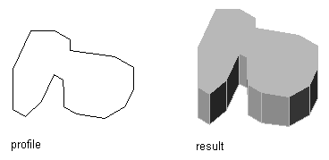
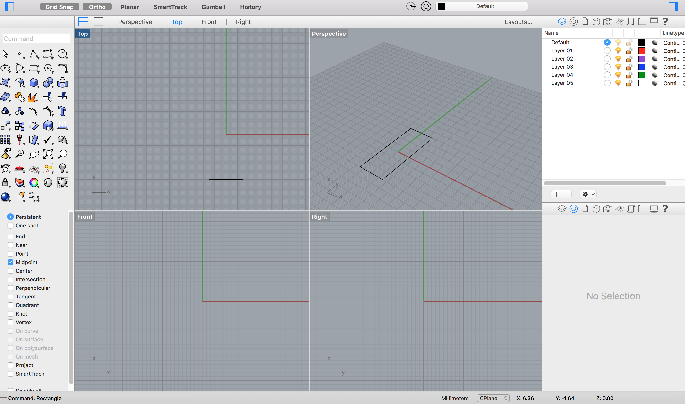

# Sessions 01 and 02

## Designing and Building Lasercut Prototype Enclosures in Rhino

This is a practical guide with limited scope to building enclosures/interface boxes, please also undertake the [Rhino Essential Training](https://www.lynda.com/Rhino-tutorials/Rhino-5-Essential-Training/133324-2.html) Lynda course.

### Task 1 - Research

### Task 2 - Simple 2D Drawing

#### Interface

Make new Large Objects mm template.

Command line

OSnap

Ortho

Grid Snap

View on panes

#### Line

Type the word "Line", you will see that in the command line, it will start to guess what you want.

Hit Enter when the word "Line" is highlighted in the command line.

In the pane labelled "Top" click on coordinate point 0,0,0. This is the first point of our line.

Now click 20mm above the first point.

If you make a mistake when clicking, just hit escape or click cancel and start again. 

You've drawn your first line!

##### Options

When you select a particular drawing method, you will be given a set of options. If you're working on a PC these options are selectable using letter keys on the keyboard, these keys are highlighted in the words of the options beneath the command line:

On a mac, there are also buttons to select the options:

#### Polyline

Now type the word "Polyline". 

Try experimenting with it, what does Polyline mean, based on what happens when you click around in the top pane?

#### Curves

OK, that's all good for straight lines, but what happens if we want a curved line. Try clicking on the curve menu at the top. There are lots of options here, all quite useful but perhaps a bit daunting. Click off the menu and try typing "_curve" into the command line. This will allow us to create a bezier curve through the points we click on the plane. Ensure you are focused in the top view pane again...

Just click around and experiment, can you undo if you made a mistake?

### Task 3 - Extrusion

Extrusion is a process used a lot in CAD and general manufacturing, and it's something we're going to be using a lot whilst we lasercut stuff. It involves creating an object that has a cross-sectional profile that is fixed.

#### Rectangle

With the top pane focused, type "rect" and the command line will auto-fill to "Rectangle". Hit enter. In the options, you will be able to select "center", go ahead. 

Click on point 0,0,0 and draw a rectangle that is 30mm wide and 80mm high. HINT: you can type those figures in if you want...

Now type "extrude" into the command line. 

#### Circle

#### Rectangle

#### Polyline

### Task 4 - Split/Boolean Split

#### Lines

#### Cylinder

#### Box

#### Sphere

### INTERLUDE - MATERIAL THICKNESS

### Task 5 - Using Layers

#### First side of box

#### Second side of box

##### Using the mirror function

#### Third side of box

### Task 6 - Construction lines

### Task 7 - Cutting objects

### Task 8 - Adding screw and USB port holes

### Task 9 - Adding text to be engraved

### Task 10 - Adding ventilation holes

### Task 11 - Using Make2D to get surface outlines

### Task 12 - Arranging your 2D shapes for cutting

### Task 13 - Open Challenge: Add Handles

### Task 14 - Open Challenge: Add a lid

### Task 15 - Open Challenge: Add a pattern to be cut on one side

### Task 16 - Open Challenge: Add holes/mountings for buttons

http://www.instructables.com/id/Laser-Cut-Boxes/

https://grabcad.com/library/arduino-uno-r3-1

