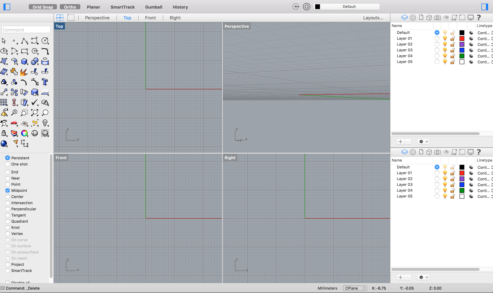
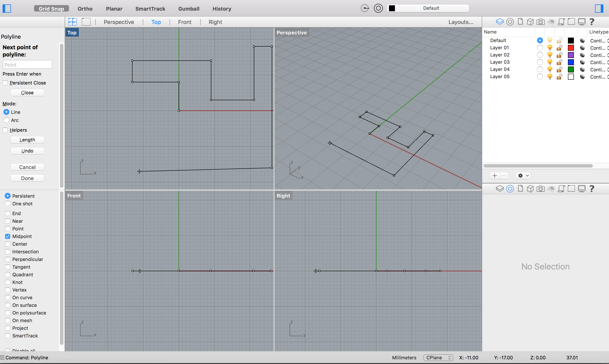

# Sessions 01 and 02

## Designing and Building Prototype Enclosures in Rhino

This is a practical guide with limited scope to building enclosures/interface boxes, please also undertake the [Rhino Essential Training](http://staging.p5js.org/tutorials/debugging.html) Lynda course.

### Task 1 - Research

### Task 2 - Simple 2D Drawing

#### Interface

Make new Large Objects mm template.

OSnap

Ortho

Grid Snap

View on panes

#### Line

Type the word "Line", you will see that in the command line, it will start to guess what you want.

Hit Enter when the word "Line" is highlighted in the command line.

In the pane labelled "Top" click on coordinate point 0,0,0. This is the first point of our line.

Now click 20mm above the first point.

If you make a mistake when clicking, just hit escape or click cancel and start again. 

You've drawn your first line!

#### Polyline

Now type the word "Polyline". 

Try experimenting with it, what does Polyline mean, based on what happens when you click around in the top pane?

#### Curves

OK, that's all good for straight lines, but what happens if we want a curved line. There are lots of options here, but try typing "_curve"...

### Task 3 - Extrusion

### Task 4 - Boolean Split

### Task 5 - Using Layers

### Task 6 - Construction lines

### Task 7 - Cutting objects

### Task 8 - Adding screw holes

### Task 9 - Engraving

### Task 10 - Adding ventilation holes

