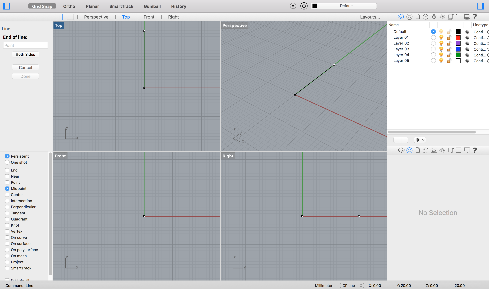
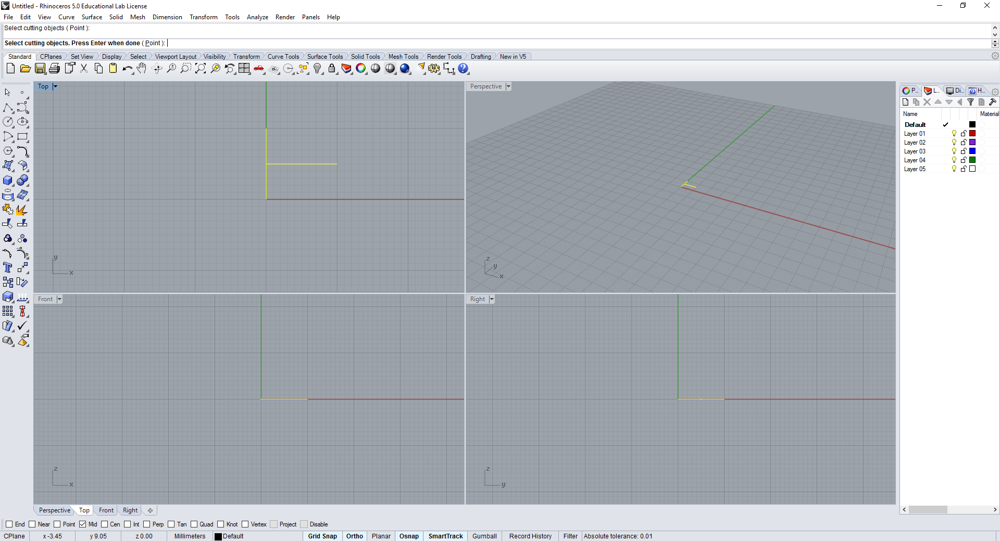

# Sessions 01 and 02

## Designing and Building Lasercut Prototype Enclosures in Rhino

This is a practical guide with limited scope to building enclosures/interface boxes, please also undertake the [Rhino Essential Training](https://www.lynda.com/Rhino-tutorials/Rhino-5-Essential-Training/133324-2.html) Lynda course.

### Task 1 - Research

### Task 2 - Simple 2D Drawing

#### Interface

Make new Large Objects mm template.

Command line

OSnap

Ortho

Grid Snap

View on panes

#### Line

Type the word "Line", you will see that in the command line, it will start to guess what you want.

Hit Enter when the word "Line" is highlighted in the command line.

In the pane labelled "Top" click on coordinate point 0,0,0. This is the first point of our line.

Now click 20mm above the first point.

If you make a mistake when clicking, just hit escape or click cancel and start again. 

You've drawn your first line!

##### Options

When you select a particular drawing method, you will be given a set of options. If you're working on a PC these options are selectable using letter keys on the keyboard, these keys are highlighted in the words of the options beneath the command line:

On a mac, there are also buttons to select the options:

You can see that we can draw from the centre, and the PC loads of other options are available.

#### Polyline

Now type the word "Polyline". 

Try experimenting with it, what does Polyline mean, based on what happens when you click around in the top pane?

#### Curves

OK, that's all good for straight lines, but what happens if we want a curved line. Try clicking on the curve menu at the top. There are lots of options here, all quite useful but perhaps a bit daunting. Click off the menu and try typing "_curve" into the command line. This will allow us to create a bezier curve through the points we click on the plane. Ensure you are focused in the top view pane again...

Just click around and experiment, can you undo if you made a mistake?

### Task 3 - Extrusion

Extrusion is a process used a lot in CAD and general manufacturing, and it's something we're going to be using a lot whilst we lasercut stuff. It involves creating an object that has a cross-sectional profile that is fixed.

#### Rectangle

With the top pane focused, type "rect" and the command line will auto-fill to "Rectangle". Hit enter. In the options, you will be able to select "center", go ahead. 

Click on point 0,0,0 and draw a rectangle that is 30mm wide and 80mm high. HINT: you can type those figures in if you want...

Now type "extrude" into the command line. 

You can see that you are presented with some options here. We want to make a solid object, so type the letter that makes it *S*olid...

Great, we created a box! Handily, there is also a "Box" command. But the principle of extrusion is really important to understand...  

#### Circle

Let's do the same with a circle:

Create a circle with a diameter of 100mm.

Then extrude it as a solid cylinder that is 500mm long.

#### Polyline

OK now draw polyline in a shape of your choosing. Make sure that the start and end points are the same so you create what is called a closed curve. Use OSnap End to your advantage.

Now extrude and make your custome shape.

### Task 4 - Split/Boolean Split

The "Split" function is another incredibly useful tool in our inventory. It uses one object to cut another. Let's try it with two lines:

#### Lines

Draw one line 10mm long. Then, use OSnap to snap to the midpoint of this line and draw another line which intersects it halfway along at a right angle.

Click on the first line and type "Split". Now click on the second line and hit enter.

Now you have three lines!

#### Cylinder

Create a cylinder by typing the word "Cylinder" into the command line. Make a cylinder that is 80mm diameter and 200mm long.

#### Box

Now make a box that starts on the midpoint of one side of the cylinder. Use Osnap to your advantage here. 

OK, type the command "Boolean Split" into the command line and hit enter. When prompted for the object to split, select the cylinder and hit enter. When prompted for cutting object, select the box and hit enter.

Now delete the box and you should see that you have split the cylinder into a custom shape.

#### Sphere

Now try the same thing but using the sphere command. Make sure it intersects with the end of the custom cylinder. Using "OSnap center" to your advantage so that it snaps to the right point.

Now do boolean split in an order of your choosing - will you split the cylinder or the sphere?

I split the sphere and deleted the cylinder:

### INTERLUDE - MATERIAL THICKNESS

### Task 5 - Using Layers

#### First side of box

#### Second side of box

##### Using the mirror function

#### Third side of box

### Task 6 - Construction lines

### Task 7 - Cutting objects

### Task 8 - Adding screw and USB port holes

### Task 9 - Adding text to be engraved

### Task 10 - Adding ventilation holes

### Task 11 - Using Make2D to get surface outlines

### Task 12 - Arranging your 2D shapes for cutting

### Task 13 - Open Challenge: Add Handles

### Task 14 - Open Challenge: Add a lid

### Task 15 - Open Challenge: Add a pattern to be cut on one side

### Task 16 - Open Challenge: Add holes/mountings for buttons

http://www.instructables.com/id/Laser-Cut-Boxes/

https://grabcad.com/library/arduino-uno-r3-1

